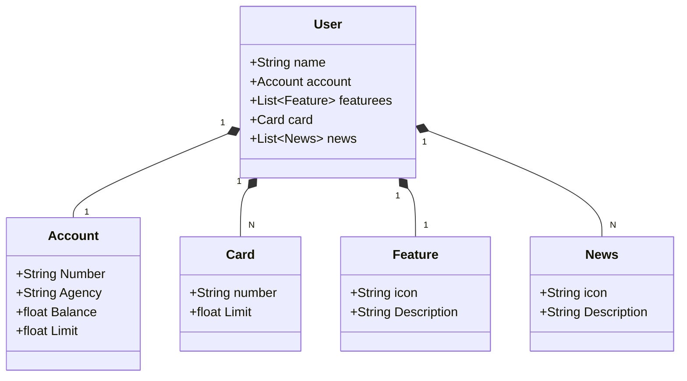

# Projeto com springboot pela dio

Java RESTfull API criada pela DIO.ME

## Diagrama de Classes

```mermaid

classDiagram
  class User {
    +String name
    +Account account
    +List~Feature~ featurees
    +Card card
    +List~News~ news
  }

  class Account {
    +String Number
    +String Agency
    +float Balance
    +float Limit
  }

  class Feature {
    +String icon
    +String Description
  }

  class Card {
    +String number
    +float Limit
  }

  class News {
    +String icon
    +String Description
  }

  User "1" *-- "1" Account
  User  "1" *-- "N" Card
  User "1" *-- "1" Feature
  User "1" *-- "N" News
```
